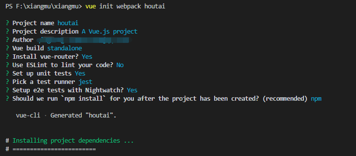
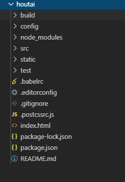
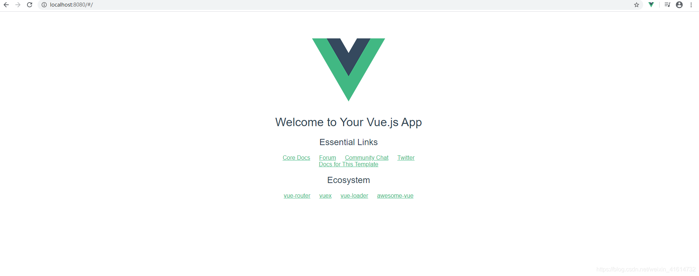
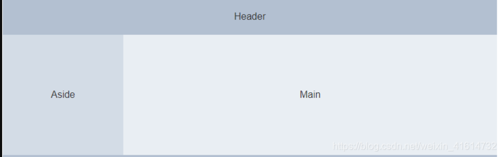
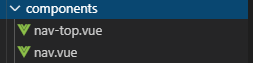
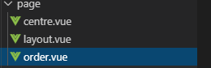
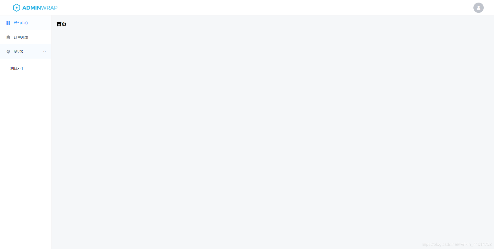

### 用vue-cli构建项目

必须之前安装好[node](https://so.csdn.net/so/search?q=node&spm=1001.2101.3001.7020)环境和npm，然后再安装vue和webpack，然后用vue-cli来构建项目。安装环境这里不细说，从搭建脚手架开始，输入vue init webpack '项目名称’命令开始构建，构建完结构如下




构建好后，npm run dev命令启动查看一下项目





脚手架搭好后我们继续安装element-ui


### 安装element-ui和搭建页面

输入以下命令安装element-ui


```vue

npm i element-ui -S

```

安装完毕后在src/main.js文件中引用element-ui

```
import Vue from 'vue'
import App from './App'
import router from './router'
import ElementUI from 'element-ui';
import 'element-ui/lib/theme-chalk/index.css';

Vue.use(ElementUI);
Vue.config.productionTip = false

/* eslint-disable no-new */
new Vue({
  el: '#app',
  router,
  components: { App },
  template: '<App/>'
})


```


我们需要搭建的布局大概是这样子的，我们先把顶部和左边导航组件创建好先




在components文件夹里创建nav-top和nav组件，分别用于顶部导航和左边的导航，logo图片是网上随便找的图片，放在src/assets/imgs/logo.png





## nav-top.vue

```vue
<style scoped>
.el-aside {
    display: flex;
    justify-content: center;
    align-items: center;
}

section{
  height: 100%;
  display: flex;
  justify-content: space-between;
  align-items: center;
  padding: 0 20px;
}

.logo {
  width: 200px;
}

.headerLogo,.logo{
  cursor: pointer;
}


</style>

<template>
  <el-container>
    <el-aside width="auto" class="header-logo tap" >
      
    </el-aside>
    <el-aside width="auto" class="header-logo tap" >
      <el-avatar icon="el-icon-user-solid" class="headerLogo"></el-avatar>
    </el-aside>
  </el-container>
</template>

<script>
export default {
  data() {
    return {
      activeIndex: "1",
    };
  },
  methods: {
    handleSelect(key, keyPath) {
      console.log(key, keyPath);
    }
  }
};
</script>

```


## nav(sidebar)

nav组件代码如下:


```vue
<style scoped>
.el-row{
  height: 100%;
}

.el-menu{
  border-right:none;
}
.el-aside{
  border-right: 1px solid #f5f1f1;
}
</style>

<template>
  <el-aside width="200px">
    <el-row class="tac">
      <el-col>
        <el-menu
          default-active="1"
          class="el-menu-vertical-demo"
          @open="handleOpen"
          @close="handleClose"
        >
          <el-menu-item index="1" @click="goPage('home')">
            <i class="el-icon-menu"></i>
            <span slot="title">后台中心</span>
          </el-menu-item>

          <el-menu-item index="2" @click="goPage('order')">
            <i class="el-icon-s-order"></i>
            <span slot="title">订单列表</span>
          </el-menu-item>

          <el-submenu index="3">
            <template slot="title">
              <i class="el-icon-location"></i>
              <span>测试3</span>
            </template>
            <el-menu-item-group>
              <el-menu-item index="3-1">测试3-1</el-menu-item>
            </el-menu-item-group>
          </el-submenu>
        </el-menu>
      </el-col>
    </el-row>
  </el-aside>
</template>

<script>
var $this = {};
export default {
  data() {
    return {};
  },
  beforeCreate() {
    $this = this;
  },
  methods: {
    handleOpen(key, keyPath) {
      console.log(key, keyPath);
    },
    handleClose(key, keyPath) {
      console.log(key, keyPath);
    },

    goPage(link) {
      if (link === "home") {
        $this.$router.push("/").catch(error => error);
      } else if ((link == "order")) {
        $this.$router.push("/order").catch(error => error);
      } else {}
    }
  }
};
</script>

```

接下来创建page文件夹，文件夹里分别创建layout.vue和centre.vue和order.vue三个文件。

注意在==src路径下==



## layout.vue

layout.vue主要做主页面，分别需要引用顶部导航和左边导航，centre.vue和order.vue两个文件分别是main部分的首页内容和订单列表内容。

layout.vue代码如下，需要引用两个组件


```vue
<style>
.el-main {
  background-color: #f5f7f9;
}

.el-header,
.el-footer {
  background-color: white;
  box-sizing: border-box;
  border-bottom: 1px solid #f5f1f1;
}

.el-container {
  height: 100%;
}
</style>

 <template>
  <el-container>
    <!-- header部分 -->
    <el-header>
      <navtop></navtop>
    </el-header>
    <el-container>
       <!-- aside部分 -->
      <leftNav></leftNav>
      <el-main>
         <!-- main部分 -->
        <router-view />
      </el-main>
    </el-container>
  </el-container>
</template>


 <script>
import navtop from "@/components/nav-top.vue";
import leftNav from "@/components/nav.vue";
export default {
  components: {
    navtop,
    leftNav
  },
  data() {
    return {};
  },
  methods: {}
};
</script>

```

centre.vue代码如下


```vue
<style>
</style>
<template>
  <div id="centre">
    <h1>首页</h1>
  </div>
</template>

<script>
export default{
    name: 'centre'
}
</script>

```

order.vue代码如下


```vue

<style>
</style>
<template>
  <div id="user">
    <h1>订单列表</h1>
  </div>
</template>

<script>
export default {
  name: 'User'
}
</script>

```

然后在src/router/index.js文件里配置路由

```vue
import Vue from 'vue'
import Router from 'vue-router'
import Layout from '@/page/layout'
import Centre from '@/page/centre'
import Order from '@/page/order'

Vue.use(Router)

export default new Router({
  routes: [
    {
      path: '/',
      name: 'Layout',
      component: Layout,
      children: [{
        path: '/',
        name: 'Centre',
        component: Centre
      }, {
        path: 'order',
        name: 'Order',
        component: Order
      }]
    },
  ]
})

```

## App.vue

对src/App.vue的布局和样式做简单的修改

```vue
<template>
  <div id="app">
    <router-view/>
  </div>
</template>

<script>

export default {
  name: 'App',
 
}
</script>

<style>
*{
  margin: 0;
  padding: 0;
}
html,body{
  width: 100%;
  height: 100%;
}
#app {
  height: 100%;
}
</style>


```

好了，大概布局已经完成了，现在输入npm run dev启动项目就可以看到管理系统布局了

