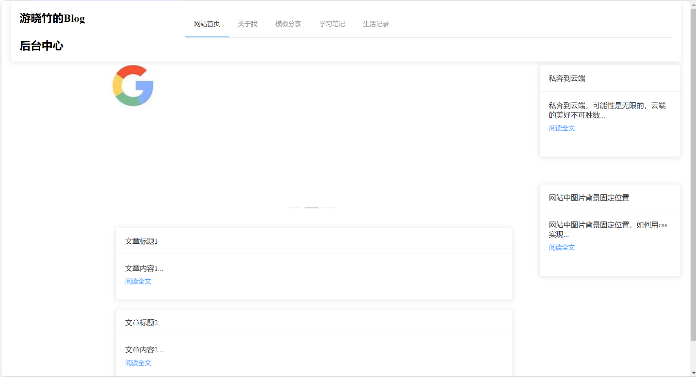

为了实现如上图所示的前端布局，可以使用Vue和Element-UI来搭建。我们将页面分为头部导航、主内容区和侧边栏三个部分，并使用Element-UI的布局组件来实现。

### 1. 项目结构

假设你的项目结构如下：
```js
/src
  /frontend
    /components
      Header.vue
      Sidebar.vue
      Content.vue
    /views
      Home.vue
  App.vue
  main.js
  router/index.js
```

### 2. 安装Element-UI
确保你已经安装了Element-UI。
```bash
npm install element-ui --save
```

### 3. main.js
在`main.js`中引入Element-UI。
```javascript
import Vue from 'vue';
import App from './App.vue';
import ElementUI from 'element-ui';
import 'element-ui/lib/theme-chalk/index.css';

Vue.use(ElementUI);

new Vue({
  render: h => h(App),
}).$mount('#app');
```


### 4. Header.vue

定义页面头部导航组件。
```vue
<template>
  <div class="header">
    <el-row :gutter="20">
      <el-col :span="6">
        <h1></h1>
      </el-col>
      <el-col :span="18">
        <el-menu mode="horizontal" :default-active="activeIndex" class="el-menu-demo" @select="handleSelect">
          <el-menu-item index="1">网站首页</el-menu-item>
          <el-menu-item index="2">关于我</el-menu-item>
          <el-menu-item index="3">模板分享</el-menu-item>
          <el-menu-item index="4">学习笔记</el-menu-item>
          <el-menu-item index="5">生活记录</el-menu-item>
        </el-menu>
      </el-col>
    </el-row>
  </div>
</template>

<script>
export default {
  name: 'Header',
  data() {
    return {
      activeIndex: '1',
    };
  },
  methods: {
    handleSelect(key, keyPath) {
      console.log(key, keyPath);
    },
  },
};
</script>

<style scoped>
.header {
  background-color: #fff;
  padding: 20px;
  box-shadow: 0 2px 12px 0 rgba(0, 0, 0, 0.1);
}
h1 {
  margin: 0;
  font-size: 24px;
}
</style>
```

### 5. Sidebar.vue
定义侧边栏组件。
```vue
<template>
  <div class="sidebar">
    <el-card class="box-card" v-for="post in posts" :key="post.id">
      <div slot="header" class="clearfix">
        <span>{{ post.title }}</span>
      </div>
      <div class="text item">
        <p>{{ post.content }}</p>
        <el-button type="text">阅读全文</el-button>
      </div>
    </el-card>
  </div>
</template>

<script>
export default {
  name: 'Sidebar',
  data() {
    return {
      posts: [
        { id: 1, title: '私奔到云端', content: '私奔到云端，可能性是无限的，云端的美好不可胜数...' },
        { id: 2, title: '网站中图片背景固定位置', content: '网站中图片背景固定位置，如何用css实现...' },
        // 更多内容...
      ],
    };
  },
};
</script>

<style scoped>
.sidebar {
  padding: 20px;
}
.box-card {
  margin-bottom: 20px;
}
</style>
```

### 6. Content.vue
定义主内容组件。
```vue
<template>
  <div class="content">
    <el-row :gutter="20">
      <el-col :span="24">
        <el-carousel indicator-position="outside">
          <el-carousel-item v-for="item in items" :key="item.id">
            
          </el-carousel-item>
        </el-carousel>
      </el-col>
    </el-row>
    <el-row :gutter="20" class="post-list">
      <el-col :span="24" v-for="post in posts" :key="post.id">
        <el-card class="box-card">
          <div slot="header" class="clearfix">
            <span>{{ post.title }}</span>
          </div>
          <div class="text item">
            <p>{{ post.content }}</p>
            <el-button type="text">阅读全文</el-button>
          </div>
        </el-card>
      </el-col>
    </el-row>
  </div>
</template>

<script>
export default {
  name: 'Content',
  data() {
    return {
      items: [
        { id: 1, src: 'path/to/image1.jpg', alt: 'Image 1' },
        { id: 2, src: 'path/to/image2.jpg', alt: 'Image 2' },
        { id: 3, src: 'path/to/image3.jpg', alt: 'Image 3' },
      ],
      posts: [
        { id: 1, title: '文章标题1', content: '文章内容1...' },
        { id: 2, title: '文章标题2', content: '文章内容2...' },
        // 更多内容...
      ],
    };
  },
};
</script>

<style scoped>
.content {
  padding: 20px;
}
.post-list {
  margin-top: 20px;
}
.box-card {
  margin-bottom: 20px;
}
</style>
```

### 7. Home.vue

#### 侧边栏居左

在`Home.vue`中定义主要布局。

```vue
<template>
  <el-container>
    <el-header>
      <Header />
    </el-header>
    <el-container>
      <el-aside width="300px">
        <Sidebar />
      </el-aside>
      <el-main>
        <router-view />
      </el-main>
    </el-container>
  </el-container>
</template>

<script>
import Header from './frontend/components/Header.vue';
import Sidebar from './frontend/components/Sidebar.vue';

export default {
  components: {
    Header,
    Sidebar,
  },
};
</script>
```

#### 侧边栏居右

```vue
<template>
    <el-container>

      <el-header>
        <Header />
      </el-header>

      <el-container>
        <el-main>
            <Content/>
        </el-main>
        <el-aside width="350px">
          <Sidebar />
        </el-aside>
      </el-container>


    </el-container>
  </template>
  
  <script>
  import Content from '../components/Content.vue';
  import Sidebar from '../components/Sidebar.vue';
  import Header from '../components/Header.vue';
  export default {
    components: {

      Content,
      Sidebar,
      Header
    },
  };
  </script>
  
  
```


### 8. 更新路由配置
在`src/router/index.js`中配置路由。
```javascript
import Vue from 'vue';
import Router from 'vue-router';
import Home from '@/frontend/views/Home.vue';

Vue.use(Router);

export default new Router({
  routes: [
    {
      path: '/',
      name: 'home',
      component: Home,
    },
    // 其他路由...
  ],
});
```

通过上述步骤，便可以实现如图所示的前端布局。可以根据实际需求进一步调整组件和样式。


## 效果

